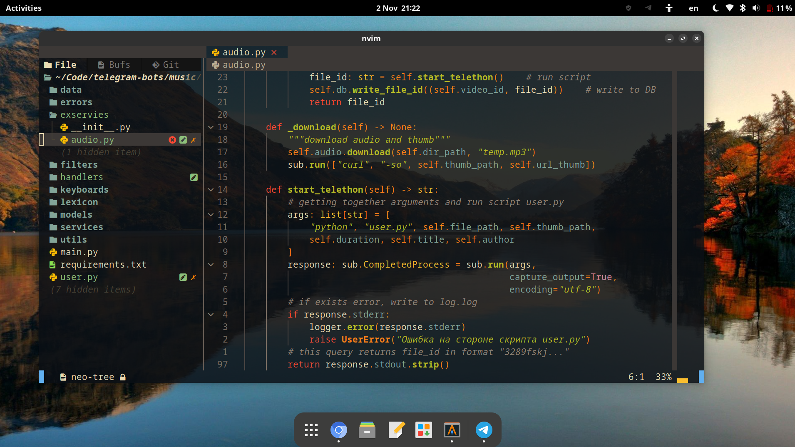

# Инструкция
1. Заходим на сайт [astroNvim](https://docs.astronvim.com/), следуем инструкции которая указана у них на сайте.
2. Выбираем любой понравившиеся шрифт [Nord](https://www.nerdfonts.com/font-downloads), лично я выбрал CodeNewRoman Nerd Font.
3. Обязательно скачиваем pyright, так как у меня в конфиге он указан как основной lsp server и будет браться с внутренней системы.
4. Если у вас alacritty, то переходим в конфиг и меняем прозрачность на **opacity: 0.85**
5. Далее, после как скачали **astronvim**, переходим в путь где лежит ваша папка с конфигом nvim.
6. Переходим в папку **lua**, у меня это так -> `~/.config/nvim/lua/`
7. Клонируем репозиторий находясь в папке **lua** `git clone https://github.com/Maclovi/user.config.git user`

***
### Далее, если вы все сделали правильно
1. Возможно, что у вас все равно будет отличаться как у меня, для этого нужно поправить кое-какой код в исходнике
2. Открываем файл `nvim ~/.config/nvim/lua/plugins/configs/heirline.lua`
3. **Ищем строчку №12** -> `local StatusLine = get_hlgroup("StatusLine", { fg = C.fg, bg = C.dark_bg })`
4. Меняем только "StatusLine" на "Normal"
